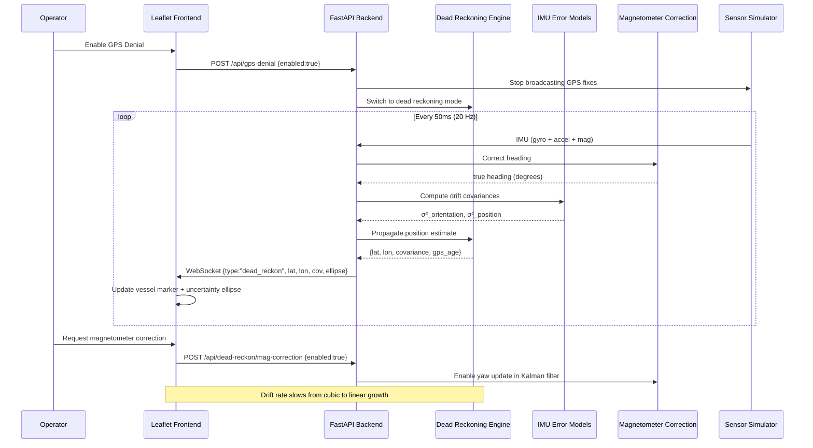

# GPS-Denied USV Position Estimation — Integration Architecture

## System Overview

The product merges four previously independent codebases into a unified web application that estimates a USV's position using IMU dead reckoning when GPS is unavailable. The core loop is: (1) sensor ingestion (real or simulated IMU + magnetometer + barometer), (2) gyro bias / Allan variance characterization, (3) propagation of position uncertainty through IMU error models, and (4) optional drift reduction via magnetometer heading corrections. A Leaflet.js map renders the dead-reckoned track with an uncertainty ellipse that grows over time, giving the operator a visual confidence region. The system also supports mission risk assessment (already built) and GPS denial toggle for operator training and testing.

---

## Component Diagram

```mermaid
graph TB
    subgraph "Frontend (Browser)"
        LF[Leaflet Map<br/>ESRI Ocean / OpenSeaMap]
        UC[Uncertainty Ellipse<br/>Canvas Overlay]
        VB[Vessel Markers<br/>Survey + Support]
        SD[Sidebar Dashboard<br/>Position, Depth, Risk]
        RP[Recording & Replay]
        DR_UI[Dead Reckoning Panel<br/>GPS Age, Covariance, Fix Type]
    end

    subgraph "Backend (FastAPI Python)"
        WS[WebSocket /ws<br/>Broadcast + History]
        SI[Sensor Ingestion<br/>POST /data, /gps, /pressure]
        SIM[Sensor Simulator<br/>20 Hz async loop]
        RR[Risk + Recording<br/>/api/risk, /api/recording/*]
        EXP[Export<br/>GeoJSON, CSV]
        DR[Dead Reckoning Engine<br/>/api/dead-reckon]
        GPSD[GPS Denial Controller<br/>/api/gps-denial]
    end

    subgraph "IMU Error Models (Python, ported from Rust)"
        AF[Allan Variance Analysis<br/>Batch σ² computation]
        DF[Drift Process Formulas<br/>σ²(t)=N²·t, μ(t)=b·t, ...]
        SU[Sum Composition<br/>Independent process addition]
    end

    subgraph "DVL/IMU Kalman Filter (Python)"
        KF[15-state Error-State Kalman<br/>pos, vel, attitude, biases]
        DV[Dead Reckoning Track<br/>Integrate corrected velocity]
        SY[Sync Pipeline<br/>Timestamp-ordered fusion]
        QC[DVL Quality Gates<br/>Beams, altitude, mode]
    end

    subgraph "Magnetometer Correction (Python)"
        MC[Hard/Soft Iron Calibration]
        TC[Tilt Compensation<br/>roll/pitch → true heading]
        DC[Declination Correction]
    end

    subgraph "Bathymetry"
        BG[Karlskrona Depth Grid<br/>60m resolution]
        DP[Depth Query API<br/>/api/depth]
    end

    subgraph "Offline Tools"
        RUST[imu-drift crate<br/>Rust CLI for batch<br/>Allan variance fitting]
        CFG[JSON Config<br/>Noise parameters,<br/>initial state]
    end

    %% Data flow
    SIM -->|IMU + mag + baro| SI
    SI --> WS
    WS --> LF
    WS --> SD

    SIM -->|gyro_z, accel| DF
    SIM -->|mag_x, mag_y, mag_z| MC
    MC -->|true heading| DR

    DR -->|estimated lat/lon| WS
    DR -->|covariance matrix| UC
    DR -->|gps_age, fix_type| DR_UI

    KF -->|position output| DR
    DV -->|integrated track| KF
    SY -->|ordered events| KF

    RUST -->|N, B, K coefficients| CFG
    CFG -->|noise params| DF
    CFG -->|Kalman config| KF

    GPSD -->|enable/disable| SIM
    GPSD --> DR

    BG --> DP
    DP --> RR
    RR --> SD

    SI --> RR
    RR --> WS

    SI --> RP
    RP --> EXP
```

---

## Data Flow Diagram (GPS-Denied Mode)



---

## Integration Strategy

| Component | Source | Integration Method | Effort |
|-----------|--------|--------------------|--------|
| FastAPI server + Leaflet UI | `maritime-mission-planner-UI` | Already merged, base platform | - |
| IMU drift process formulas | `imu-drift` Rust crate | **Reimplement in Python** (trivial math: N²·t, ½·b·t², etc.) | 1 day |
| Allan variance analysis | `imu-drift` Rust crate | **Keep as Rust CLI**, call via `subprocess` for batch analysis | 0.5 day |
| Drift path sampling | `imu-drift` Rust crate | **Reimplement in Python** using numpy Box-Muller | 0.5 day |
| DVL/IMU Kalman filter | `dvl_correction` Python | **Import directly** as package dependency | 0.5 day |
| IMU-only propagation mode | `dvl_correction` Python | Add method to `DvlImuKalmanLayer` for GPS-denied mode | 1 day |
| Magnetometer calibration | `bengt/add-magnometer` | **New Python module** `src/magnetometer.py` | 1 day |
| Uncertainty ellipse rendering | `bengt/frontend` React Canvas | **Implement directly** in Leaflet via `L.circle` + rotation transform | 1 day |
| GPS denial simulation | New | **API toggle** `POST /api/gps-denial` | 0.5 day |

### Why Reimplement Drift Formulas Instead of PyO3

The IMU drift process math is a handful of multiplication chains:

```
ARW angle variance:  σ²(t) = N² · t
Gyro bias:           μ(t) = b_g · t
Bias instability:    σ²(t) = (2·ln2/π) · B² · t²
Gyro×gravity pos:    μ(t) = ½ · g · b_g · t³
VRW position:        σ²(t) = N_a² · t³ / 3
```

These are 5 lines of Python each. Adding PyO3/maturin as a build dependency is not worth the complexity for the live server path. The Rust crate remains valuable for offline Allan variance fitting — run `cargo run --release -- allan-variance --samples imu.csv` to get N, B, K coefficients, then write those into the JSON configuration file.

### Where Magnetometer Calibration Runs

Magnetometer correction runs in the **Python ingestion pipeline** as a preprocessor, before the heading enters the dead reckoning engine. The pipeline is:

1. Raw magnetometer (x, y, z) arrives at `/data`
2. Server pulls latest roll/pitch from orientation buffer
3. Applies hard-iron offset and soft-iron scaling matrix
4. Applies tilt compensation (project onto horizontal plane)
5. Adds magnetic declination → true heading
6. Feeds true heading into the dead reckoning or Kalman filter

### How Uncertainty Ellipse Renders in Leaflet

The backend sends a `dead_reckon` WebSocket message containing ellipse parameters computed from the covariance matrix P[0:2, 0:2]:

```json
{
  "type": "dead_reckon",
  "lat": 56.1301,
  "lon": 15.5800,
  "gps_age_sec": 45.2,
  "fix_type": "dead_reckon",
  "ellipse": {
    "semi_major_m": 12.4,
    "semi_minor_m": 8.1,
    "orientation_deg": 37.2
  }
}
```

The frontend renders this as a styled `L.circle` transformed to match the ellipse orientation, or uses a custom polygon computed from the eigen-decomposition. No Leaflet plugin needed — a 64-point polygon from the parametric ellipse equation is sufficient.

### GPS Denial Simulation

Controlled via API. When enabled, the simulator stops producing GPS fixes but continues producing all IMU/magnetometer/barometer data. The dead reckoning engine starts from the last known GPS position and propagates forward.

```
POST /api/gps-denial
Body: {"enabled": true}
Response: {"gps_denied": true, "last_gps": {"lat": ..., "lon": ..., "age_sec": 0}}

GET /api/gps-denial
Response: {"enabled": true, "last_gps": {"lat": 56.130, "lon": 15.580, "age_sec": 45.2}}
```

The server tracks `state.gps_denied` and `state.last_gps_before_denial`. When enabled, the simulator still computes GPS positions internally but does not broadcast them or add them to the track buffer. When disabled, the next GPS fix is broadcast and the dead reckoning state resets.

---

## API Contracts

### POST /api/dead-reckon (Manual Trigger)

Request dead reckoning computation at the current time.

```
POST /api/dead-reckon
Body: {}
Response: {
  "lat": 56.1301,
  "lon": 15.5800,
  "gps_age_sec": 45.2,
  "fix_type": "gps" | "dead_reckon" | "dead_reckon_mag",
  "ellipse": {
    "semi_major_m": 12.4,
    "semi_minor_m": 8.1,
    "orientation_deg": 37.2
  },
  "covariance": [[0.25, 0.02], [0.02, 0.18]],
  "drift_stats": {
    "arw_deg_per_sqrt_s": 0.01,
    "bias_instab_deg_per_s": 0.005,
    "gyro_bias_deg_per_s": 0.05,
    "total_drift_deg": 2.3,
    "position_uncertainty_m": 12.4
  }
}
```

### WebSocket Message: `dead_reckon`

Broadcast automatically at ~1 Hz when in GPS-denied mode.

```json
{
  "type": "dead_reckon",
  "lat": 56.1301,
  "lon": 15.5800,
  "gps_age_sec": 45.2,
  "fix_type": "dead_reckon",
  "ellipse": {
    "semi_major_m": 12.4,
    "semi_minor_m": 8.1,
    "orientation_deg": 37.2
  }
}
```

### POST /api/gps-denial

```
POST /api/gps-denial
Body: {"enabled": true}
Response: {
  "gps_denied": true,
  "last_gps": {"lat": 56.1300, "lon": 15.5800, "age_sec": 0.0},
  "simulator_gps_stopped": true
}
```

### GET /api/dead-reckon/status

```
GET /api/dead-reckon/status
Response: {
  "gps_denied": true,
  "gps_age_sec": 45.2,
  "fix_type": "dead_reckon_mag",
  "estimated_position": {"lat": 56.1301, "lon": 15.5800},
  "drift": {
    "gyro_bias_dps": 0.05,
    "arw_deg_per_sqrt_s": 0.01,
    "total_heading_drift_deg": 2.3,
    "position_uncertainty_m": 12.4
  },
  "ellipse": {
    "semi_major_m": 12.4,
    "semi_minor_m": 8.1,
    "orientation_deg": 37.2
  }
}
```

---

## Minimal Viable Integration

The smallest change that demonstrates GPS-denied estimation is:

1. **Add a Python module** `src/dead_reckon.py` implementing:
   - `DriftProcess` class with ARW + gyro bias composition (equations from the Rust crate)
   - `DeadReckoner` class that holds last-known GPS position, propagates via heading + speed, computes uncertainty ellipse

2. **Add a toggle** `state.gps_denied` on the server, with `POST /api/gps-denial`

3. **Add `GET /api/dead-reckon/status`** endpoint returning current estimate

4. **Modify the simulator** to suppress GPS broadcasts when `state.gps_denied` is true

5. **Frontend**: Add a "GPS Denied" button, receive and render the `dead_reckon` WebSocket message, draw uncertainty ellipse as a Leaflet polygon

This gives a working demo in ~2 days: toggle GPS denial, watch the vessel marker continue moving via IMU-only, see the uncertainty ellipse grow.

---

## File Layout After Integration

```
hackathon/
  src/
    server.py              # + dead-reckon endpoints, GPS denial toggle
    dead_reckon.py         # NEW: drift processes, position propagation
    magnetometer.py        # NEW: hard/soft-iron, tilt compensation
    bathymetry.py          # unchanged
    static/index.html      # + ellipse rendering, GPS denial UI
  dvl_correction/
    src/...                # unchanged, importable by server.py
  imu-drift/
    src/...                # unchanged, binary for offline Allan fitting
    Cargo.toml
  tests/
    test_server.py         # + dead-reckon, GPS-denial tests
    test_dead_reckon.py    # NEW: drift math, ellipse computation
    test_magnetometer.py   # NEW: calibration math
```
